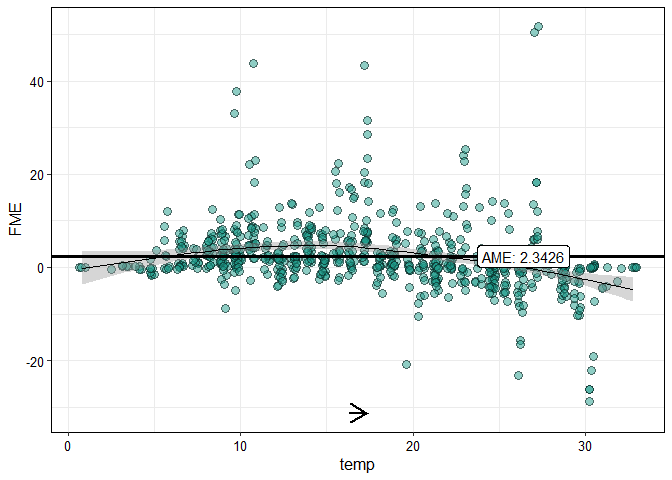

<!-- README.md is generated from README.Rmd. Please edit that file -->

[](https://www.repostatus.org/#active)

# **`fmeffects`**: An R Package for Forward Marginal Effects 

This package implements [forward marginal effects
(FMEs)](https://arxiv.org/abs/2201.08837), a model-agnostic framework
for interpreting feature effects in machine learning models. FMEs are
the simplest and most intuitive way to interpret feature effects - we
explain [here](https://holgstr.github.io/fme/articles/fme_theory.html)
how they are computed and why they should be preferred to existing
methods. Currently, `fme` supports regression and (binary)
classification models from the
[caret](https://topepo.github.io/caret/available-models.html) and
[mlr3](https://mlr3learners.mlr-org.com/) libraries.

## Quickstart

See [here](https://holgstr.github.io/fme/articles/fme.html) for an
in-depth tutorial. The big advantage of FMEs is that they are
interpreted similar to beta coefficients in linear regression models.
Consider the following example: how does an increase in temperature
(`temp`) by 1°C affect bike rentals (`count`)?

``` r
# Compute effects for a trained model 'forest':
effects = fme(model = forest,
              data = bikes,
              target = "count",
              feature = "temp",
              step.size = 1)
plot(effects, jitter = c(0.2, 0))
```

<!-- -->

On average, an increase in temperature by 1°C results in an increase in
the predicted number of bike rentals by more than 2. This is called the
average marginal effect (AME).

Let’s compute the AME for every feature of the model:

``` r
# Compute AMEs with default step sizes:
ame(model = forest,
    data = bikes,
    target = "count")
```
