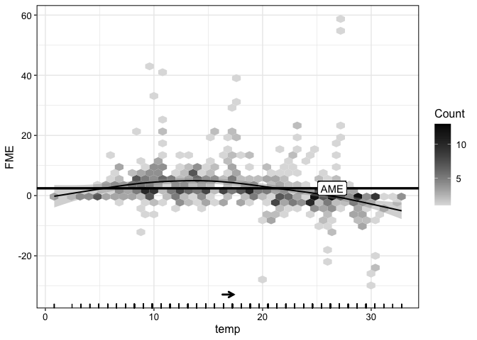

<!-- README.md is generated from README.Rmd. Please edit that file -->
<!-- badges: start -->

[](https://www.repostatus.org/#active)
[](https://www.r-pkg.org/badges/version-last-release/fmeffects)
[](https://github.com/holgstr/fmeffects/actions/workflows/R-CMD-check.yaml)
[](https://cranlogs.r-pkg.org/badges/grand-total/fmeffects)
<!-- badges: end -->

# **`fmeffects`**: An R Package for Forward Marginal Effects 

This package implements [forward marginal effects
(FMEs)](https://link.springer.com/article/10.1007/s10618-023-00993-x), a
model-agnostic framework for interpreting feature effects in machine
learning models. FMEs are the simplest and most intuitive way to
interpret feature effects - we explain
[here](https://holgstr.github.io/fmeffects/articles/fme_theory.html) how
they are computed and why they should be preferred to existing methods.
Currently, `fmeffects` supports 100+ regression and (binary)
classification models:

- All models from the
  [tidymodels](https://www.tidymodels.org/find/parsnip/),
  [mlr3](https://mlr3learners.mlr-org.com/) and
  [caret](https://topepo.github.io/caret/available-models.html)
  libraries.
- Native support for `lm`-type models, e.g. `glm` or `gam`.

## Installation

**CRAN:**

``` r
install.packages("fmeffects")
```

**GitHub:**

``` r
if (!require("remotes")) {
  install.packages("remotes")
}
remotes::install_github("holgstr/fmeffects")
```

## Quickstart

See [here](https://holgstr.github.io/fmeffects/articles/fmeffects.html)
for an in-depth tutorial. The big advantage of FMEs is that they are
interpreted similar to beta coefficients in linear regression models.
Consider the following example: how does an increase in temperature
(`temp`) by 1°C affect bike rentals (`count`)?

``` r
set.seed(123)
library(fmeffects)
data(bikes)
```

### Train a Model

#### `tidymodels`

``` r
# Train a model with tidymodels:
library(tidymodels)
forest <- rand_forest() %>%
  set_mode("regression") %>%
  set_engine("ranger")
forest <- forest %>% fit(count ~ ., data = bikes)
```

#### `mlr3`

``` r
# Train a model with mlr3:
library(mlr3verse)
task <- as_task_regr(x = bikes, target = "count")
forest <- lrn("regr.ranger")$train(task)
```

### Compute effects

``` r
effects <- fme(model = forest,
              data = bikes,
              features = list(temp = 1))
summary(effects)
#> 
#> Forward Marginal Effects Object
#> 
#> Step type:
#>   numerical
#> 
#> Features & step lengths:
#>   temp, 1
#> 
#> Extrapolation point detection:
#>   none, EPs: 0 of 731 obs. (0 %)
#> 
#> Average Marginal Effect (AME):
#>   56.7848
```

### Plot effects

``` r
plot(effects)
```

<!-- -->

On average, an increase in temperature by 1°C results in an increase in
the predicted number of bike rentals by more than 56. This is called the
average marginal effect (AME).

### Model Overview

Let’s compute the AME for every feature of the model:

``` r
overview <- ame(model = forest,
                data = bikes)
summary(overview)
#> 
#> Model Summary Using Average Marginal Effects:
#> 
#>       Feature step.size       AME       SD       0.25       0.75   n
#> 1      season    winter -906.3152 452.5878 -1271.0584  -600.2563 550
#> 2      season    spring  133.4859 560.2646  -251.9123   656.0786 547
#> 3      season    summer  290.1049 538.7409   -38.9006   749.0648 543
#> 4      season      fall  522.5996 569.6906    44.5897   1109.532 553
#> 5        year         0 -1899.879 633.9108 -2386.0419 -1505.6763 366
#> 6        year         1 1784.2169 512.4153  1437.0613    2188.87 365
#> 7     holiday        no  192.3511 243.8668    88.2007   234.6339  21
#> 8     holiday       yes -125.4963 162.4853  -201.8025   -16.1199 710
#> 9     weekday    Sunday  162.5495  191.207    18.7489   271.2774 626
#> 10    weekday    Monday -157.9409 223.1961  -265.1487    -4.9606 626
#> 11    weekday   Tuesday -116.1417 198.0911   -202.525    12.3244 626
#> 12    weekday Wednesday  -48.2876 175.2334  -124.9116    62.7098 627
#> 13    weekday  Thursday   12.3041 164.3111   -69.5711    86.6357 627
#> 14    weekday    Friday   58.2788  166.217   -23.7812   138.4033 627
#> 15    weekday  Saturday  109.3594 171.4439     3.0084   191.9563 627
#> 16 workingday        no  -40.2099 132.4716  -139.6087    63.0035 500
#> 17 workingday       yes   48.4213  152.836   -66.5641   141.8286 231
#> 18    weather     misty -215.4948 314.4225  -406.0824   -66.8453 484
#> 19    weather     clear   366.836 321.0056   146.1407   460.0033 268
#> 20    weather      rain -710.9229 338.3372  -967.2359  -477.8959 710
#> 21       temp         1   56.7848 165.6973   -23.7236   103.5828 731
#> 22   humidity      0.01  -20.1036  60.3589    -36.062    11.4318 731
#> 23  windspeed         1  -23.4009  76.1323   -53.8099    15.4921 731
```
