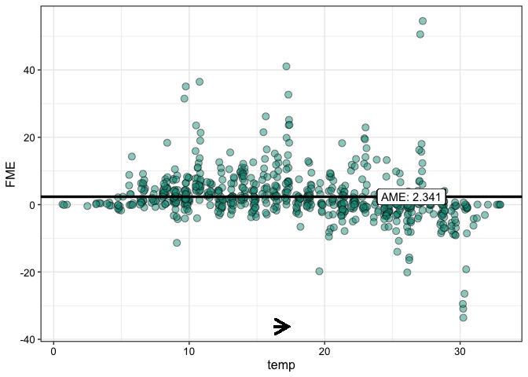

<!-- README.md is generated from README.Rmd. Please edit that file -->
<!-- badges: start -->

[](https://www.repostatus.org/#active)
[](https://www.r-pkg.org/badges/version-last-release/fmeffects)
[](https://cranlogs.r-pkg.org/badges/grand-total/fmeffects)
<!-- badges: end -->

# **`fmeffects`**: An R Package for Forward Marginal Effects 

This package implements [forward marginal effects
(FMEs)](https://arxiv.org/abs/2201.08837), a model-agnostic framework
for interpreting feature effects in machine learning models. FMEs are
the simplest and most intuitive way to interpret feature effects - we
explain
[here](https://holgstr.github.io/fmeffects/articles/fme_theory.html) how
they are computed and why they should be preferred to existing methods.
Currently, `fmeffects` supports regression and (binary) classification
models from the [mlr3](https://mlr3learners.mlr-org.com/),
[tidymodels](https://www.tidymodels.org/find/parsnip/) and
[caret](https://topepo.github.io/caret/available-models.html) libraries.

## Quickstart

See [here](https://holgstr.github.io/fmeffects/articles/fmeffects.html)
for an in-depth tutorial. The big advantage of FMEs is that they are
interpreted similar to beta coefficients in linear regression models.
Consider the following example: how does an increase in temperature
(`temp`) by 1°C affect bike rentals (`count`)?

``` r
# Train a random forest on "bike" data
set.seed(123)
library(fmeffects)
library(mlr3verse)
data(bikes)
task = as_task_regr(x = bikes, id = "bikes", target = "count")
forest = lrn("regr.ranger")$train(task)
```

``` r
# Compute effects for a trained model 'forest':
effects = fme(model = forest,
              data = bikes,
              target = "count",
              feature = "temp",
              step.size = 1)
plot(effects, jitter = c(0.2, 0))
```

<!-- -->

On average, an increase in temperature by 1°C results in an increase in
the predicted number of bike rentals by more than 2. This is called the
average marginal effect (AME).

Let’s compute the AME for every feature of the model:

``` r
# Compute AMEs with default step sizes:
overview = ame(model = forest,
               data = bikes,
               target = "count")
summary(overview)
```

    #> 
    #> Model Summary Using Average Marginal Effects:
    #> 
    #>       Feature step.size       AME      SD      0.25      0.75   n
    #> 1      season    spring   -29.472 31.5101   -39.955   -5.5139 548
    #> 2      season    summer    0.4772 22.5212   -9.0235   11.6321 543
    #> 3      season      fall   11.7452 28.5851   -2.4282   34.1763 539
    #> 4      season    winter   15.5793 24.6394    1.6525   26.2254 551
    #> 5        year         0   -99.038 67.1788 -157.0608  -20.0628 364
    #> 6        year         1   97.0566  60.521   21.9401  148.0847 363
    #> 7       month         1    4.0814 13.3513   -1.2566     7.459 727
    #> 8     holiday     False   -1.2178 21.6103   -9.1095    9.8232  21
    #> 9     holiday      True   -13.738 25.3496  -32.6323    6.2019 706
    #> 10    weekday       Sat  -55.0908 49.6534  -87.6489  -15.8843 622
    #> 11    weekday       Sun  -85.1527 57.7791 -122.1504  -31.8105 622
    #> 12    weekday       Mon   10.7224 29.2179   -8.4101   30.4207 623
    #> 13    weekday       Tue   17.9396  25.728    1.1959   32.5073 625
    #> 14    weekday       Wed   20.4025 23.1599    1.3386   32.8358 623
    #> 15    weekday       Thu   19.4455 24.1105   -0.3097   33.4997 624
    #> 16    weekday       Fri    1.7712 35.3088  -24.8956   29.5147 623
    #> 17 workingday     False -204.1875 89.3882  -257.144 -142.4332 496
    #> 18 workingday      True  161.0619 62.5733  118.9398  209.6916 231
    #> 19    weather     clear   26.1983 41.7886    3.5991   25.9257 284
    #> 20    weather     misty     3.023 32.8661   -9.1498     0.973 513
    #> 21    weather      rain  -55.3083 53.0127  -94.4096    -5.481 657
    #> 22       temp         1    2.3426  7.1269   -0.4294    4.5534 727
    #> 23   humidity      0.01   -0.2749   2.626   -0.3249    0.3504 727
    #> 24  windspeed         1    0.0052  2.4318   -0.1823    0.2318 727
